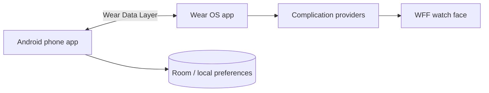

# Pixel Dot Matrix

Pixel Dot Matrix is an open-source, local-first Pomodoro system for Android
phones and Wear OS. The repository contains a phone companion, a circular
Wear OS app, and a Watch Face Format (WFF) watch face.

## Highlights

- Phone and watch timer controls with revisioned state synchronization
- Focus, short-break, long-break, and panic/recovery sessions
- Circular Wear UI with crown navigation and session-specific colors
- Configurable dot-matrix watch face colors, text, logo, and complications
- Offline command queues for disconnected phone/watch operation
- Local session insights, incident capture, and optional DNS protection
- Local-first storage with granular data deletion controls

## Modules

| Module | Purpose | Minimum API |
|---|---|---:|
| `app` | Android phone companion | 24 |
| `wear` | Wear OS timer and complication providers | 28 |
| `watchface` | Resource-only WFF v2 watch face | 34 |

The phone and Wear modules intentionally retain their existing application ID
so installed development builds remain compatible. Product branding is
independent from the application ID.

## Build

Requirements:

- JDK 17
- Android SDK with API 36 installed
- Android Studio or the included Gradle wrapper

Create `local.properties` with your Android SDK path, then run:

```bash
./gradlew testDebugUnitTest \
  :app:assembleDebug \
  :wear:assembleDebug \
  :watchface:assembleDebug
```

Generated APKs are written under each module's `build/outputs/apk/debug/`
directory.

## Install for Development

With a phone and watch connected through ADB:

```bash
adb -s PHONE_SERIAL install -r app/build/outputs/apk/debug/app-debug.apk
adb -s WATCH_SERIAL install -r wear/build/outputs/apk/debug/wear-debug.apk
adb -s WATCH_SERIAL install -r watchface/build/outputs/apk/debug/watchface-debug.apk
```

Select **Pixel Dot Matrix** from the watch-face picker after installing or
updating the WFF package.

## Architecture



See [Architecture](docs/ARCHITECTURE.md),
[Implementation Guide](IMPLEMENTATION.md), and
[Feature Roadmap](FEATURE_ROADMAP.md) for detailed design and progress.

## Contributing

Contributions are welcome. Read [CONTRIBUTING.md](CONTRIBUTING.md) before
opening a pull request. Use a branch named for the change, such as
`feature/daily-focus-target` or `fix/watch-sync-retry`.

## Privacy and Security

The application is designed to keep timer, task, incident, and configuration
data on the user's devices. Review [Privacy](docs/PRIVACY.md) and report
security issues using [SECURITY.md](SECURITY.md).

## Maintainer

[WingsDavis](https://github.com/WingsDavis)

## License

Licensed under the [MIT License](LICENSE).
Bundled font licenses are listed in [Third-Party Notices](THIRD_PARTY_NOTICES.md).
